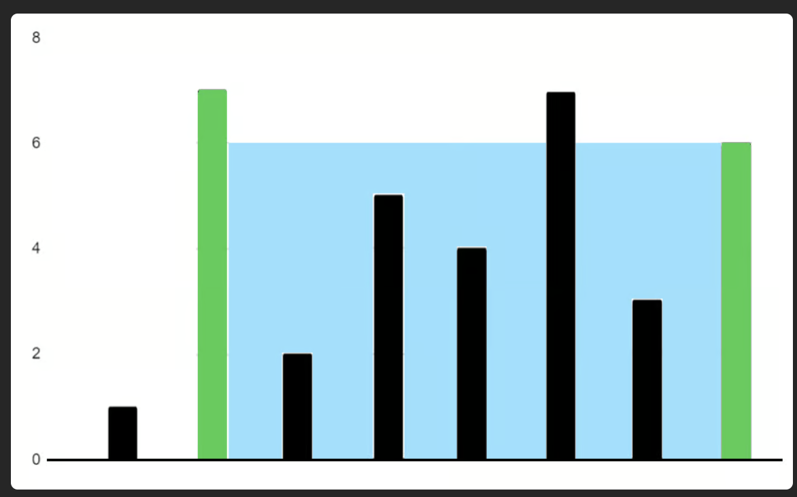

## Container With Most Water
You are given an integer array heights where heights[i] represents the height of the 
ith bar.

You may choose any two bars to form a container. Return the maximum amount of water a container can store.

Example 1:

Input: height = [1,7,2,5,4,7,3,6]
Output: 36

Example 2:
Input: height = [2,2,2]
Output: 4

**Constraints:**
2 <= height.length <= 1000
0 <= height[i] <= 1000

**Recommended Time & Space Complexity**
You should aim for a solution with O(n) time and O(1) space, where n is the size of the input array.

**Hint 1**
A brute force solution would be to try all pairs of bars in the array, compute the water for each pair, and return the maximum water among all pairs. This would be an O(n^2) solution. Can you think of a better way?

**Hint 2**
Can you think of an algorithm that runs in linear time and is commonly used in problems that deal with pairs of numbers? Find a formula to calculate the amount of water when we fix two heights.

**Hint 3**
We can use the two pointer algorithm. One pointer is at the start and the other at the end. At each step, we calculate the amount of water using the formula (j - i) * min(heights[i], heights[j]). Then, we move the pointer that has the smaller height value. Can you think why we only move the pointer at smaller height?

**Hint 4**
In the formula, the amount of water depends only on the minimum height. Therefore, it is appropriate to replace the smaller height value.

