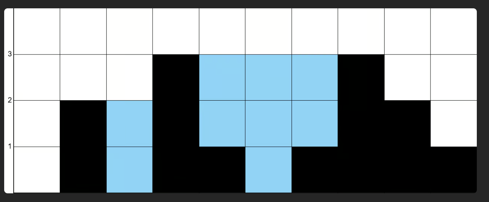

Trapping Rain Water

You are given an array non-negative integers height which represent an elevation map. Each value height[i] represents the height of a bar, which has a width of 1.
Return the maximum area of water that can be trapped between the bars.

Example 1:

Input: height = [0,2,0,3,1,0,1,3,2,1]
Output: 9

**Constraints:**
1 <= height.length <= 1000
0 <= height[i] <= 1000

Recommended Time & Space Complexity
**Hint 1**
How can we determine the amount of water that can be trapped at a specific position in the array? Perhaps looking at the image might help clarify.

**Hint 2**
From the image, we can see that to calculate the amount of water trapped at a position, the greater element to the left l and the greater element to the right r of the current position are crucial. The formula for the trapped water at index i is given by: min(height[l], height[r]) - height[i].

**Hint 3**
A brute force solution would involve iterating through the array with index i, finding the greater elements to the left (l) and right (r) for each index, and then calculating the trapped water for that position. The total amount of trapped water would be the sum of the water trapped at each index. Finding l and r for each index involves repeated work, resulting in an O(n^2) solution. Can you think of a more efficient approach? Maybe there is something that we can precompute and store in arrays.

**Hint 4**
We can store the prefix maximum in an array by iterating from left to right and the suffix maximum in another array by iterating from right to left. For example, in [1, 5, 2, 3, 4], for the element 3, the prefix maximum is 5, and the suffix maximum is 4. Once these arrays are built, we can iterate through the array with index i and calculate the total water trapped at each position using the formula: min(prefix[i], suffix[i]) - height[i].

